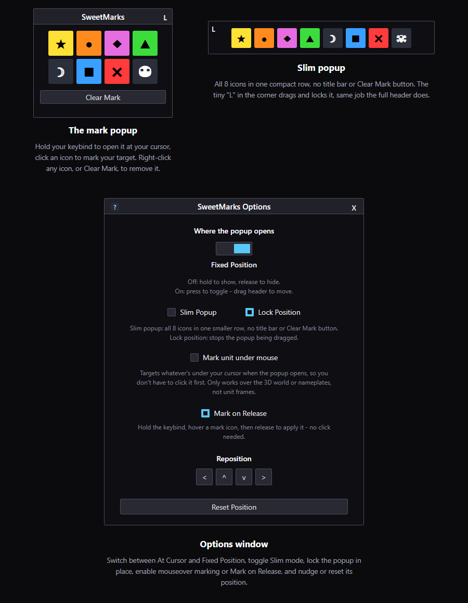

A keybind popup for quickly marking targets with raid icons, solo or in a group, for Turtle WoW / Octo WoW (1.12 client).

Download from https://github.com/Doajy/SweetMarks/releases remove the -main and place in your addons folder

## Setup

1. Open **Key Bindings** in-game (Escape → Key Bindings), find the **SweetMarks** category, and bind a key to **Show/Toggle Mark Popup**.
2. Open **Options** to pick how the popup should behave — `/sm options`, `/smoptions`, or click the skull icon on the minimap.

## Using it

- **Hold your keybind** to open the popup at your mouse cursor. Click one of the 8 raid icons to mark your current target. Release the key to close the popup.
- **Right-click any icon** (or click **Clear Mark**) to remove the mark from your current target.
- With **Mark on Release** enabled (see Options below), you don't need to click at all: hold the keybind, hover an icon, and release the key to mark your target with it. Combine with **Mark unit under mouse** for a full mouseover-to-mark flow — mouseover a unit, hold the keybind, hover the icon, release.
- Marking works the same whether you're solo, in a party, or have raid assist — permissions follow normal WoW rules (raid members without assist can't set marks for others).

## Options

- **Where the popup opens** — *At Cursor* (default, hold-to-show as above) or *Fixed Position* (press the key to toggle it open/closed instead, and it stays put where you last dragged it).
- **Slim popup** — shows all 8 icons in a single smaller row with no title bar or Clear Mark button.
- **Lock position** — only shown in Fixed Position mode; stops the popup from being dragged by accident. In Slim mode, the tiny "L" in the popup's top-left corner does the same thing.
- **Visible Marks** — click any icon in this row to hide it from the popup (dimmed = hidden). The grid (or slim row) reflows to fit whatever's left, so the popup shrinks instead of leaving gaps. At least one mark must stay visible.
- **Mark unit under mouse** — off by default. When enabled, opening the popup targets whatever's under your cursor at that instant, so you can mark it without clicking it first. Only works over the 3D world or nameplates, not unit frames (a vanilla client limitation, not an addon setting).
- **Mark on Release** — off by default. When enabled, releasing the keybind while hovering an icon marks your target with it, no click needed. Works in both popup modes. Pairs well with Mark unit under mouse: mouseover a unit, hold the keybind, hover the icon, release.
- **Reposition arrows** — only shown in Fixed Position mode; nudge the popup up/down/left/right in small steps, as an alternative to dragging it by hand.
- **Reset Position** — snaps the popup back to the center of the screen.

## Slash commands

- `/sm` or `/sweetmarks` — manually toggle the popup (useful for repositioning it without holding the keybind).
- `/sm options` or `/smoptions` — open the Options window.
